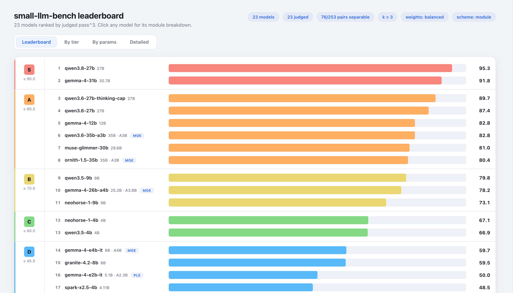
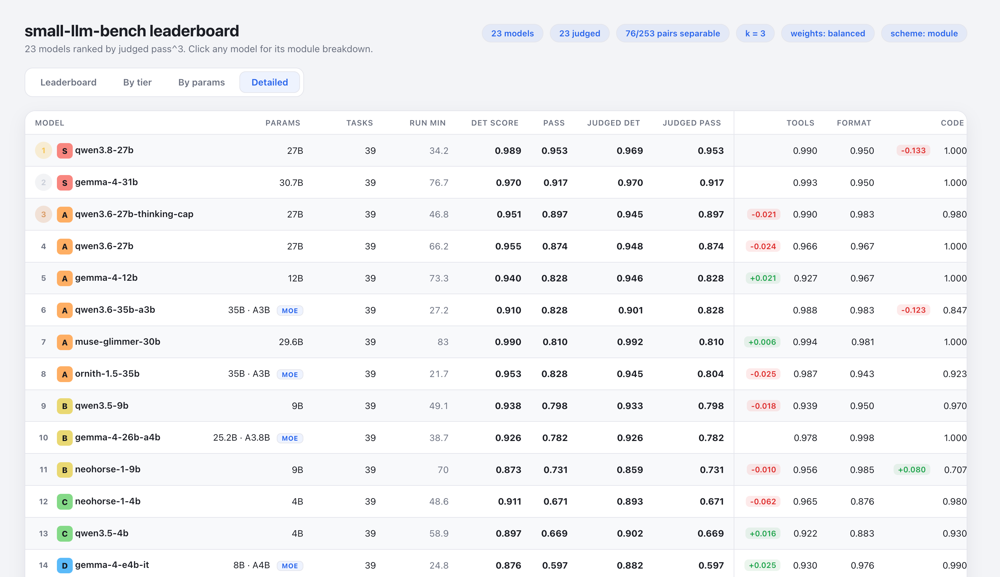
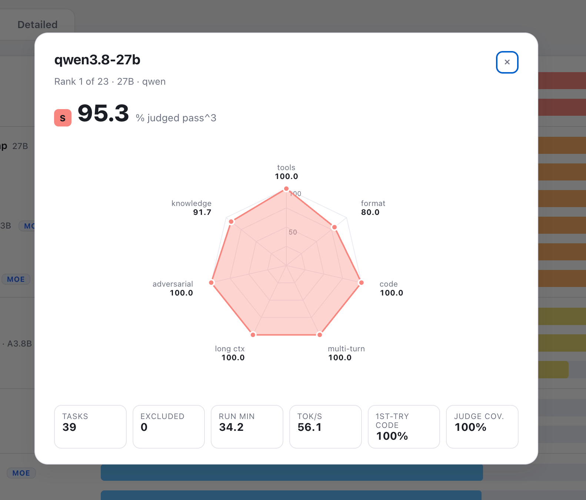

# small-llm-bench

[](https://github.com/aguyintech/small-llm-bench/actions/workflows/test.yml)
[](LICENSE)


**A benchmark for the small models you actually run locally**, roughly 1B to
35B, on the work you actually give them: calling tools, editing state over many
steps, fixing code, following instructions across a conversation, and pulling
the right fact out of a long document.

It talks to any OpenAI-compatible endpoint (llama.cpp, Ollama, LM Studio,
vLLM, oMLX), simulates every tool so it runs air-gapped, grades
deterministically, and reports pass^3: a task counts only if the model gets it
right three times out of three.



## Why another benchmark

Most benchmarks either test academic knowledge or are heavyweight frameworks
that take a day to set up. Small local models mostly do *agentic* work, and
there was no quick, reproducible way to compare them on it. This one aims to
be that:

- **Agentic, not trivia.** 39 tasks over 7 modules, most of them multi-step:
  process a queue of orders against a budget, apply requests in timestamp
  order when one of them corrects an earlier one, edit a Markdown file without
  breaking its tables, recover from a tool that fails in a specific way.
- **Graded on outcomes.** Tool tasks are scored on the final state of a
  simulated backend, code on hidden tests run in a sandbox, retrieval on the
  exact value. No LLM is needed to get a score.
- **Recovery counts.** Code gets execution feedback and can fix itself; tools
  fail on purpose and the model has to respond correctly. What matters is
  whether the model reliably arrives, not whether its first token was right.
- **Honest about its limits.** Every row says how many tasks it was scored on.
  The board marks pairs it cannot statistically separate, and
  [the list of what it cannot tell you](#what-it-cannot-tell-you) is part of
  the README.
- **Light.** A Python CLI with eight dependencies. The leaderboard is one
  static HTML file.

## What it measures

| Module | Tasks | Grounded in | What it tests |
|---|---|---|---|
| `tools` | 13 | BFCL, τ-bench | Multi-step episodes graded on final backend state: order processing under a budget, a request queue with a retroactive correction, document edits graded on structure, a two-part change where one half is already done. Plus parallel calls, a complex schema, and a conditional action |
| `code` | 5 | HumanEval, SWE-bench | One function from scratch and four bug repairs (one needs a sibling constants file), run against hidden tests with an execute-and-fix loop |
| `format` | 5 | IFEval | Strict JSON under many simultaneous constraints, typed values, extraction from messy notes, a translated summary with rules about what not to translate |
| `long_context` | 4 | RULER, NoLiMa | A stale-value needle, a needle that shares no words with the question, a 32k-token variable chain, and who owns a task after a later turn reverses it |
| `multi_turn_if` | 4 | Multi-IF | Rules that accumulate over 4–7 turns, including one the user cancels, a correction that forces a recompute, and a banned word a later question tempts |
| `adversarial` | 4 | AgentDojo, XSTest | Instruction overrides, direct and indirect system-prompt extraction, an injection inside a document the agent reads |
| `knowledge` | 4 | GSM8K, CRUXEval | Multi-step arithmetic and predicting what a short program prints |

`--profile fast` runs a 17-task subset as a smoke test.

## Quick start

Requires Python 3.10+ and an OpenAI-compatible endpoint. The package is not
on PyPI yet; install from a checkout, and run from the repository root so the
task bank in `tasks/` is found.

```bash
git clone https://github.com/aguyintech/small-llm-bench
cd small-llm-bench
pip install -e .
cp .env.example .env          # set BENCH_ENDPOINT, and JUDGE_API_KEY if you will judge
```

Run a model, optionally judge it, and build the board:

```bash
sllmb run --model qwen3:8b --trials 3 --thinking --concurrency 1
sllmb judge --results results/qwen3_8b_raw_results.json      # optional
sllmb leaderboard --open
```

`sllmb` is a short alias for `small-llm-bench`. `run` prints a scorecard when
it finishes and writes `results/<model>_raw_results.json`. An interrupted run
resumes when you re-issue the same command.

A full run at 3 trials and concurrency 1 took 22 to 134 minutes per model on
the reference hardware (median 47). Speed depends on your server far more than
on the bench.

### Code sandbox

`code` is the only module that executes model output, and it never runs on
the host. The bench uses Docker or Podman if available, otherwise bubblewrap
on Linux or `sandbox-exec` on macOS. If none exists, code tasks are skipped
rather than run unconfined. See [Sandboxing](docs/methodology.md#sandboxing).

## The leaderboard

`sllmb leaderboard` writes one self-contained HTML file: no server, no CDN.
The default view groups models into score tiers (S ≥ 90, A ≥ 80, B ≥ 70,
C ≥ 60, D ≥ 45, E ≥ 30, F below); other tabs show each tier on its own, models
bucketed by size with dense and sparse split, and the full table.



Click any model for its card: a radar of per-module pass^3, run time,
throughput, first-try code rate and judge coverage.

<p align="center">
  
</p>

Model sizes come from [`models.yaml`](models.yaml), filled in from model cards
rather than model names. Mixture-of-experts models show total and active
parameters and are compared by active parameters. Adding your model is a
one-line change.

### Placing a model against the reference fleet

Run it with the same settings the fleet used and build the board over both.
Details in [results/reference/README.md](results/reference/README.md).

```bash
sllmb run --model <name> --trials 3 --thinking --concurrency 1 \
    --output results/reference/<name>_raw_results.json
sllmb judge --results results/reference/<name>_raw_results.json
sllmb leaderboard --results-dir results/reference
```

Any row whose settings differ from the rest is flagged, so a mismatched run
cannot slip into the comparison unnoticed.

## How scoring works

1. **Each trial passes or fails** against deterministic checks. Running out
   of tokens before finishing is a failure; a server or network error is
   excluded instead.
2. **Each task gets pass^k** from its trials: the chance that k runs all
   pass. With 3 trials, a task passed 2 of 3 times contributes nothing to
   pass^3.
3. **Modules are weighted** (`balanced` preset: tools 0.30, format 0.15, code
   0.15, multi-turn 0.13, long context 0.12, adversarial 0.08, knowledge 0.07)
   and no module may carry more than twice its share of the bank.
4. **The optional LLM judge** reviews the agentic modules and can overturn a
   verdict only under strict rules. It never overrides a hard gate like a
   forbidden tool call. On the reference fleet it changed 6 of 2,070 judged
   verdicts.

Everything else, including each module's scorer, the judge rules and how to
read a scorecard, is in the [methodology](docs/methodology.md).

## What it cannot tell you

A sorted table always looks more decisive than its evidence, so:

- **It resolves tiers, not ranks.** On the 23-model reference fleet, 76 of 253
  model pairs are statistically separable, and none of the 22 adjacent pairs
  are. A one-place difference is not a finding. `sllmb items` prints the
  intervals and the pairwise test for exactly this reason.
- **It barely separates a 12B from a 27B.** One task (`tst_63`, a late
  correction that decides whether a conditional fires) does it cleanly, and
  two more lean that way. It answers "is the 12B worth it over the 4B" much
  better than "is the 27B worth it over the 12B".
- **It does not compare serving configurations.** A thinking budget or a
  quantization is a configuration question, and the bank has no items built
  to isolate one.
- **It does not measure safety or refusal calibration.** Those tracked
  post-training rather than size and were removed. `adversarial` measures
  resistance to prompt injection, which is different.
- **`knowledge` is a floor detector.** Nearly every model above about 3B
  passes it.
- **Runtime is not a model property.** It depends on your hardware and
  server, and the reference numbers were taken at concurrency 1.

What it is good for: telling you quickly whether a new small model is in the
same class as the one you already run, or clearly below it.

## Documentation

- [CLI reference](docs/cli.md) — every command, option and environment
  variable
- [Methodology](docs/methodology.md) — scoring, the judge, reading results,
  sandboxing
- [Changelog](CHANGELOG.md) — how the bench got here
- [History](docs/history/) — point-in-time reviews and the full engineering
  log

## Contributing

See [CONTRIBUTING.md](CONTRIBUTING.md). New tasks go through `sllmb probe`
before they enter the bank.

## License

MIT — see [LICENSE](LICENSE).
